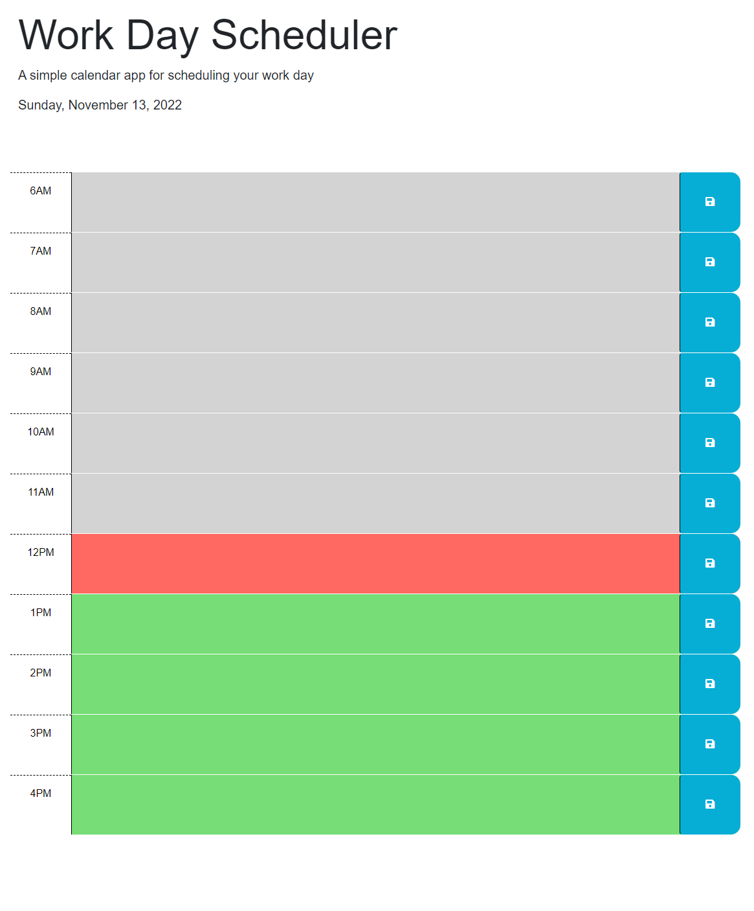

# Daily Task Manager

## Description

I have a super hard time keeping track of all of the tasks that I have at work. This site makes it easier to keep track of the hour that I'm on, and save tasks that need done. The tasks even carry over later, as when the save button is pushed, the local storage saves any content typed.

## Usage 

If the hour is in the past, it shows grey. If the hour is current, it shows red. If the hour shows green, it is in the future.

## Credits

Worked with Christin C. and Josh T. from my Bootcamp to get this project done.